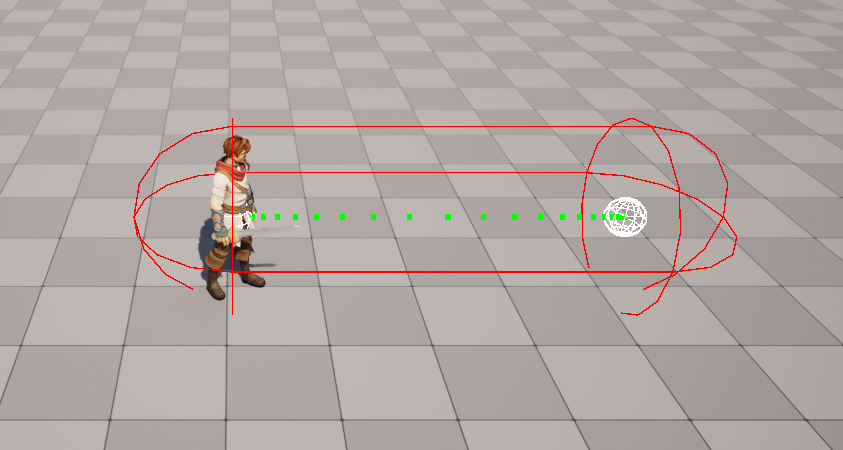
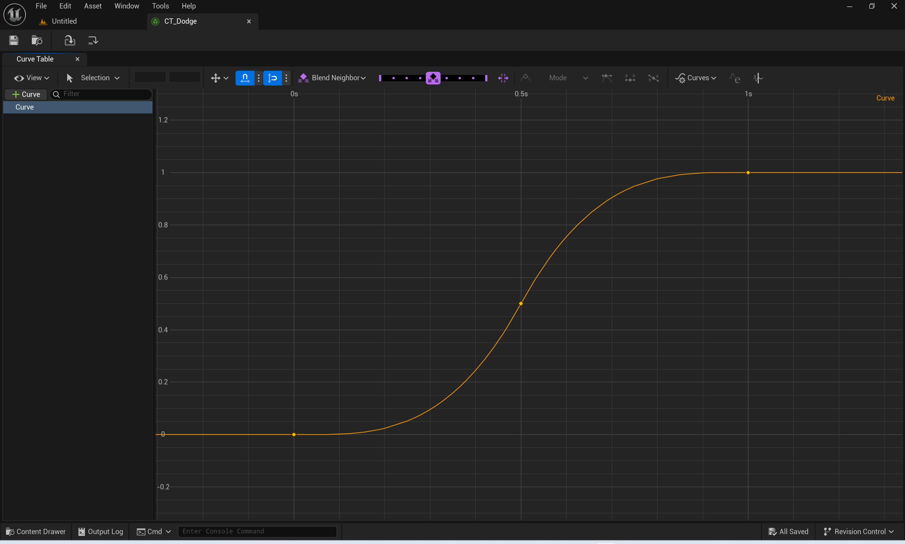
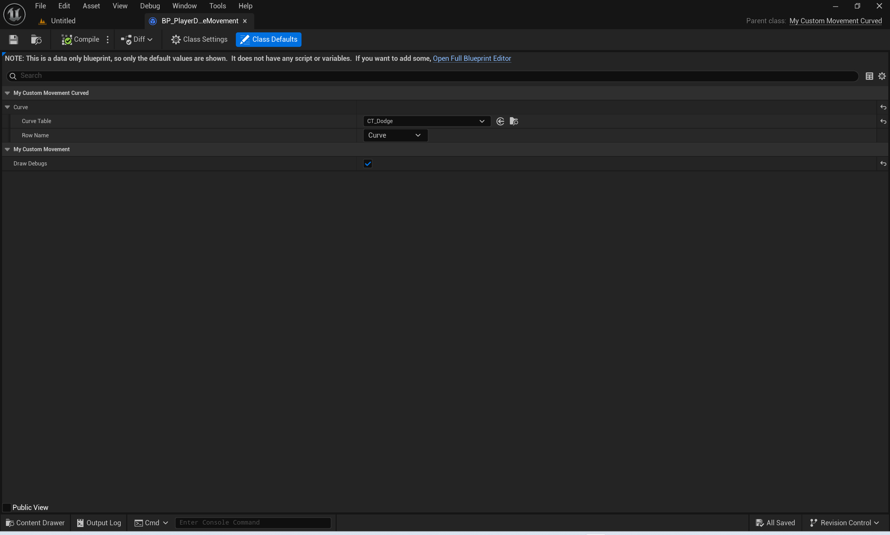
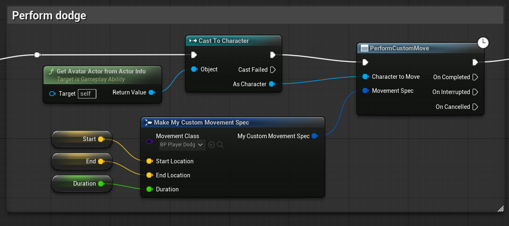

有时候我们需要执行一种可以由给定的起点、终点和时间来确定的运动，可以通过重写 CMC 的 PhysCustom 函数实现。

本文最终实现的效果为下图，可以根据 CurveTable 调整的变速运动。



## 角色移动流程

查看 CMC 的源码，调用链大概为：

TickComponent(DeltaSeconds) -> PerformMovement(DeltaSeconds) -> StartNewPhysics(DeltaSeconds, Iterations)

在 StartNewPhysics 中可以看到这样的状态机：

```cpp
	switch ( MovementMode )
	{
	case MOVE_None:
		break;
	case MOVE_Walking:
		PhysWalking(deltaTime, Iterations);
		break;
	case MOVE_NavWalking:
		PhysNavWalking(deltaTime, Iterations);
		break;
	case MOVE_Falling:
		PhysFalling(deltaTime, Iterations);
		break;
	...
	case MOVE_Custom:
		PhysCustom(deltaTime, Iterations);
		break;
	...
	}
```

官方文档：

*移动模式 MOVE_Custom 会中止所有其他移动物理效果，可实现自定义移动逻辑，不受 UCharacterMovementComponent 正常进程的干扰。*

*UCharacterMovementComponent 通常不可蓝图化，因此蓝图中的自定义移动通常是使用 UpdateCustomMovement 事件直接在角色内实现。可使用 Custom Movement Mode 字节变量通过整数开关或自定义列举转换提供子模式。*

所以我们可以重写 PhysCustom 函数来实现自定义运动。

## 自定义运动

设计思路：参照了 GameplayAbility，使用一个 UObject 代表自定义运动，为了减少频繁创建这个对象，对于每类运动只在每个 Character 上创建一个实例，由CMC负责具体执行这个运动。我们将会创建一个 CustomMovement 基类，并实现一套生命周期，供CMC调用和蓝图重写。

**CustomMovement 基类**

```cpp
DECLARE_DYNAMIC_MULTICAST_DELEGATE(FOnMovementStart);
DECLARE_DYNAMIC_MULTICAST_DELEGATE(FOnMovementEnd);

UCLASS(Blueprintable)
class XX_API UMyCustomMovement : public UObject
{
	GENERATED_BODY()

public:
	virtual bool IsSupportedForNetworking() const override { return true; }

	/** Initialize this movement before it starts */
	UFUNCTION(BlueprintCallable)
	virtual void InitializeMovement(const FVector& InStartLocation, const FVector& InEndLocation, float InDuration);

	/** Called when the movement starts */
	virtual void StartMovement(UCharacterMovementComponent* MoveComp);

	/** Calculate the velocity for delta time */
	virtual FVector TickDeltaMovement(UCharacterMovementComponent* MoveComp, float DeltaTime);

	/** Called when the movement ends */
	virtual void EndMovement(UCharacterMovementComponent* MoveComp);

	UPROPERTY(BlueprintAssignable)
	FOnMovementStart OnMovementStart;

	UPROPERTY(BlueprintAssignable)
	FOnMovementEnd OnMovementEnd;

	/** This movement is finished */
	bool IsFinished() const;

	UPROPERTY(EditDefaultsOnly)
	bool bDrawDebugs = false;

protected:
	TObjectPtr<ACharacter> OwnerCharacter;

	FVector StartLocation;
	FVector EndLocation;
	float Duration;

	float ElapsedTime;
	FVector LastFrameVelocity;
	FVector LastFrameLocation;
};
```
```cpp
void UMyCustomMovement::InitializeMovement(const FVector& InStartLocation, const FVector& InEndLocation, float InDuration)
{
	// Reset properties
	ElapsedTime = 0.f;
	LastFrameLocation = InStartLocation;
	LastFrameVelocity = FVector::ZeroVector;

	StartLocation = InStartLocation;
	EndLocation = InEndLocation;
	Duration = InDuration;

	if (bDrawDebugs)
	{
		UKismetSystemLibrary::DrawDebugSphere(this, StartLocation, 20, 12, FColor::White, 3);
		UKismetSystemLibrary::DrawDebugSphere(this, EndLocation, 20, 12, FColor::White, 3);
	}
}

void UMyCustomMovement::StartMovement(UCharacterMovementComponent* MoveComp)
{
	BP_StartMovement(MoveComp);
	OnMovementStart.Broadcast();
}

FVector UMyCustomMovement::TickDeltaMovement(UCharacterMovementComponent* MoveComp, float DeltaTime)
{
	ElapsedTime += DeltaTime;
	BP_TickDeltaMovement(MoveComp, DeltaTime);
	return FVector::ZeroVector;
}

void UMyCustomMovement::EndMovement(UCharacterMovementComponent* MoveComp)
{
	BP_EndMovement(MoveComp);
	OnMovementEnd.Broadcast();
}

bool UMyCustomMovement::IsFinished() const
{
	return ElapsedTime >= Duration;
}
```

这个 CustomMovement 类包含了我们所需的信息：起始位置、结束位置和运动时长。下面要创建的具体运动基于这个类。

**CustomMovementSpec**

```cpp
USTRUCT(BlueprintType)
struct FMyCustomMovementSpec
{
	GENERATED_BODY()

	FMyCustomMovementSpec()
		: MovementClass(nullptr),
		  StartLocation(FVector()),
		  EndLocation(FVector()),
		  Duration(0.f)
	{
	}

	FMyCustomMovementSpec(const TSubclassOf<UMyCustomMovement>& InMovement, const FVector& InStartLocation, const FVector& InEndLocation, float InDuration)
		: MovementClass(InMovement),
		  StartLocation(InStartLocation),
		  EndLocation(InEndLocation),
		  Duration(InDuration)
	{
	}

	/** Movement of the spec */
	UPROPERTY(BlueprintReadWrite)
	TSubclassOf<UMyCustomMovement> MovementClass;

	UPROPERTY(BlueprintReadWrite)
	FVector StartLocation;

	UPROPERTY(BlueprintReadWrite)
	FVector EndLocation;

	UPROPERTY(BlueprintReadWrite)
	float Duration;
};
```

在我们的 CMC，重写 PhysCustom 和 OnMovementModeChanged 函数。

**MyCharacterMovementComponent**

```cpp
UCLASS(ClassGroup=(Custom), meta=(BlueprintSpawnableComponent))
class XX_API UMyCharacterMovementComponent : public UCharacterMovementComponent
{
	GENERATED_BODY()

public:
	UMyCharacterMovementComponent();
	virtual bool ReplicateSubobjects(class UActorChannel* Channel, class FOutBunch* Bunch, FReplicationFlags* RepFlags) override;

	/** Create a custom movement instance using the specific class, add it to the instance list and as a subobject of the component owner */
	UFUNCTION(BlueprintCallable)
	UMyCustomMovement* AssignCustomMovementInstance(TSubclassOf<UMyCustomMovement> CustomMovementClass);

	/** Start a custom movement using spec */
	UFUNCTION(BlueprintCallable)
	UMyCustomMovement* StartCustomMovement(const FMyCustomMovementSpec& Spec);

protected:
	virtual void PhysCustom(float DeltaTime, int32 Iterations) override;
	virtual void OnMovementModeChanged(EMovementMode PreviousMovementMode, uint8 PreviousCustomMode) override;

private:
	UPROPERTY()
	TArray<TObjectPtr<UMyCustomMovement>> CustomMovements;

	UPROPERTY()
	TObjectPtr<UMyCustomMovement> ActiveMovement;
};
```

```cpp
UMyCharacterMovementComponent::UMyCharacterMovementComponent()
{
	PrimaryComponentTick.bCanEverTick = true;
	SetIsReplicatedByDefault(true);
}

bool UMyCharacterMovementComponent::ReplicateSubobjects(class UActorChannel* Channel, class FOutBunch* Bunch, FReplicationFlags* RepFlags)
{
	bool WroteSomething = Super::ReplicateSubobjects(Channel, Bunch, RepFlags);
	if (ActiveMovement)
	{
		WroteSomething |= Channel->ReplicateSubobject(ActiveMovement, *Bunch, *RepFlags);
	}
	for (UMyCustomMovement* Movement : CustomMovements)
	{
		if (Movement)
		{
			WroteSomething |= Channel->ReplicateSubobject(Movement, *Bunch, *RepFlags);
		}
	}
	return WroteSomething;
}

UMyCustomMovement* UMyCharacterMovementComponent::AssignCustomMovementInstance(TSubclassOf<UMyCustomMovement> CustomMovementClass)
{
	AActor* Owner = GetOwner();
	check(Owner);

	UMyCustomMovement* MovementInstance = NewObject<UMyCustomMovement>(Owner, CustomMovementClass.Get());
	check(MovementInstance);

	// Add it to one of our instance lists so that it doesn't GC.
	CustomMovements.Add(MovementInstance);

	return MovementInstance;
}

UMyCustomMovement* UMyCharacterMovementComponent::StartCustomMovement(const FMyCustomMovementSpec& Spec)
{
	for (UMyCustomMovement* Movement : CustomMovements)
	{
		if (Movement->GetClass() == Spec.MovementClass.Get())
		{
			ActiveMovement = Movement;
		}
	}

	if (ActiveMovement)
	{
		ActiveMovement->InitializeMovement(Spec.StartLocation, Spec.EndLocation, Spec.Duration);
	}

	SetMovementMode(MOVE_Custom);

	return ActiveMovement;
}

void UMyCharacterMovementComponent::PhysCustom(float DeltaTime, int32 Iterations)
{
	Super::PhysCustom(DeltaTime, Iterations);

	// @CharacterMovementComponent::PhysWalking()
	if (DeltaTime < MIN_TICK_TIME)
	{
		return;
	}

	// Time slice to avoid low frame rate
	float RemainingTime = DeltaTime;

	const EMovementMode StartingMovementMode = MovementMode;
	const uint8 StartingCustomMovementMode = CustomMovementMode;

	// Perform the move
	while (RemainingTime >= MIN_TICK_TIME && Iterations < MaxSimulationIterations)
	{
		Iterations++;
		const float TimeTick = GetSimulationTimeStep(RemainingTime, Iterations);
		RemainingTime -= TimeTick;

		// Save current values
		const FVector OldLocation = UpdatedComponent->GetComponentLocation();

		// Accumulate velocity from custom movements
		if (ActiveMovement)
		{
			UMyCustomMovement* Movement = ActiveMovement;

			FVector AccumulatedVelocity = Movement->TickDeltaMovement(this, TimeTick);

			// Move
			FHitResult Hit;
			SafeMoveUpdatedComponent(AccumulatedVelocity, GetLastUpdateRotation(), true, Hit);

			// Draw debugs
			UKismetSystemLibrary::DrawDebugPoint(this, CharacterOwner->GetActorLocation(), 5.f, FColor::Blue, 5.f);

			if (Movement->IsFinished())
			{
				SetMovementMode(MOVE_Walking);
				break;
			}
		}

		// If we didn't move at all this iteration then abort (since future iterations will also be stuck).
		if (UpdatedComponent->GetComponentLocation() == OldLocation)
		{
			RemainingTime = 0.f;
			break;
		}
	}
}

void UMyCharacterMovementComponent::OnMovementModeChanged(EMovementMode PreviousMovementMode, uint8 PreviousCustomMode)
{
	Super::OnMovementModeChanged(PreviousMovementMode, PreviousCustomMode);

	if (MovementMode == MOVE_Custom)
	{
		if (ActiveMovement)
		{
			ActiveMovement->StartMovement(this);
		}
	}
	if (PreviousMovementMode == MOVE_Custom)
	{
		if (ActiveMovement)
		{
			ActiveMovement->EndMovement(this);
		}
	}
}
```

PhysCustom 的实现参考了 CMC 的 PhysWalking，采用了时间切片的方式，因为我们的移动是基于 DeltaTime 的，如果帧率过低会导致 DeltaTime 变大，角色每帧的移动距离就会变长，这样可能会导致卡墙作弊等问题...

OnMovementModeChanged 用于执行本次运动的生命周期 StartMovement 和 EndMovement。

AssignCustomMovementInstance 用于分配一个 CustomMovement 实例给 OwnerCharacter，可以在角色的 BeginPlay 中调用。

StartCustomMovement 用于执行一次具体的运动，会在 CustomMovements 列表中查找对应类型的的实例，并开启一次运动。

## 创建对应的 Async Action

为了配合 GAS 在蓝图中更方便地使用我们的自定义运动，考虑到这是一个有执行时间的动作，比较适合创建一个 Blueprint Async Action 来包装其为一个 Latent Node。

**AsyncAction_CustomMove**

```cpp
DECLARE_DYNAMIC_MULTICAST_DELEGATE(FMovementSimpleDelegate);

UCLASS()
class XX_API UAsyncAction_CustomMove : public UBlueprintAsyncActionBase
{
	GENERATED_BODY()

public:
	UPROPERTY(BlueprintAssignable)
	FMovementSimpleDelegate OnCompleted;

	UPROPERTY(BlueprintAssignable)
	FMovementSimpleDelegate OnInterrupted;

	UPROPERTY(BlueprintAssignable)
	FMovementSimpleDelegate OnCancelled;

	UFUNCTION(BlueprintCallable, meta = (BlueprintInternalUseOnly = "true"))
	static UAsyncAction_CustomMove* PerformCustomMove(ACharacter* CharacterToMove, const FMyCustomMovementSpec& MovementSpec);

	/** Called to trigger the action once the delegates have been bound */
	virtual void Activate() override;

	/** Explicitly end the action, will disable any callbacks and allow action to be destroyed */
	UFUNCTION(BlueprintCallable)
	virtual void EndAction();

	/** This should be called prior to broadcasting delegates back into the event graph, this ensures the action and CMC are still valid */
	virtual bool ShouldBroadcastDelegates() const;

private:
	UFUNCTION()
	void OnMovementCompleted();
	
	TWeakObjectPtr<UMyCharacterMovementComponent> CharacterMovementComponent;
	
	FMyCustomMovementSpec MovementSpec;
};
```

```cpp
UAsyncAction_CustomMove* UAsyncAction_CustomMove::PerformCustomMove(ACharacter* CharacterToMove, const FMyCustomMovementSpec& MovementSpec)
{
	check(CharacterToMove);

	UAsyncAction_CustomMove* MyObj = NewObject<UAsyncAction_CustomMove>();

	MyObj->CharacterMovementComponent = CharacterToMove->GetCharacterMovement<UMyCharacterMovementComponent>();
	MyObj->MovementSpec = MovementSpec;

	return MyObj;
}

void UAsyncAction_CustomMove::Activate()
{
	UMyCustomMovement* Movement = CharacterMovementComponent->StartCustomMovement(MovementSpec);

	if (ShouldBroadcastDelegates() && IsValid(Movement))
	{
		Movement->OnMovementEnd.AddDynamic(this, &ThisClass::OnMovementCompleted);
	}
}

void UAsyncAction_CustomMove::EndAction()
{
	// Child classes should override this if they need to explicitly unbind delegates that aren't just using weak pointers
	// Clear our CMC so it won't broadcast delegates
	CharacterMovementComponent = nullptr;
	SetReadyToDestroy();
}

bool UAsyncAction_CustomMove::ShouldBroadcastDelegates() const
{
	// By default, broadcast if our CMC is valid
	if (CharacterMovementComponent.IsValid())
	{
		return true;
	}
	return false;
}

void UAsyncAction_CustomMove::OnMovementCompleted()
{
	OnCompleted.Broadcast();
}
```

开启一个运动并绑定了它的委托。

## 实现一个变速直线运动

**MyCustomMovement_Curved**

```cpp
/**
 * Perform a movement based on a given curve
 * The curve must be normalize, and has at least two keys (0. 0) and (1, 1), representing the start and end point
 * The the X axis represents the timeline, and the Y axis represents the distance progress of this movement
 * The slope of the curve will be the velocity
 */
UCLASS()
class XX_API UMyCustomMovement_Curved : public UMyCustomMovement
{
	GENERATED_BODY()

public:
	virtual void PostInitProperties() override;
	virtual FVector TickDeltaMovement(UCharacterMovementComponent* MoveComp, float DeltaTime) override;

private:
	/** Normalize Distance Progress - Timeline Curve */
	UPROPERTY(EditDefaultsOnly)
	FCurveTableRowHandle Curve;

	bool CurveValid;
};
```

```cpp
void UMyCustomMovement_Curved::PostInitProperties()
{
	Super::PostInitProperties();

	// Check if the curve is valid
	FString ContextString = FString();
	CurveValid = Curve.IsValid(ContextString)
		&& FMath::IsNearlyEqual(Curve.Eval(0.f, ContextString), 0.f)
		&& FMath::IsNearlyEqual(Curve.Eval(1.f, ContextString), 1.f);
}

FVector UMyCustomMovement_Curved::TickDeltaMovement(UCharacterMovementComponent* MoveComp, float DeltaTime)
{
	Super::TickDeltaMovement(MoveComp, DeltaTime);

	if (!CurveValid) return FVector::Zero();
	FString ContextString = FString();

	// Calculate the velocity this frame
	// Velocity = (D * f (x / T))' = D / T * f'(x)
	// f'(x) = f(x + delta_x) - f(x - delta_x) / (2 * delta_X)
	float X = (ElapsedTime == 0.f) ? 0.f : (ElapsedTime / Duration); // Safe devide
	float DeltaX = DeltaTime / Duration;
	float Distance = (EndLocation - StartLocation).Length();
	float X1 = FMath::Clamp(X + DeltaX, 0, 1);
	float X2 = FMath::Clamp(X - DeltaX, 0, 1);
	float Velocity = (Distance / Duration) *
		((Curve.Eval(X1, ContextString) - Curve.Eval(X2, ContextString)) / (2 * DeltaX));

	// Draw debugs
	if (bDrawDebugs)
	{
		UKismetSystemLibrary::DrawDebugPoint(this, MoveComp->GetActorLocation(), 5.f, FColor::Green, 5.f);
	}

	return Velocity * (EndLocation - StartLocation).GetUnsafeNormal() * DeltaTime;
}
```

主要是重写了 TickDeltaMovement 实现运动逻辑，使用一个 CurveTable 代表距离 - 时间的归一化曲线，其中 X 轴为归一化时间，Y 轴为归一化运动距离，计算其导数，再乘上一个 DeltaTime 就可以得到每帧的速度大小。

PostInitProperties 主要是保证我们的 Curve 是符合要求的。

## 测试效果

在编辑器中创建一个 CurveTable。



和一个 DodgeMovement 蓝图类。



在闪避 GA 中使用这个节点。



激活 GA，可以看到角色按照设置的曲线进行了变速运动。


得益于 CMC 完善的预测机制，我们无需实现额外的网络部分代码，在延迟 200ms 时客户端也可以有较好的体验。